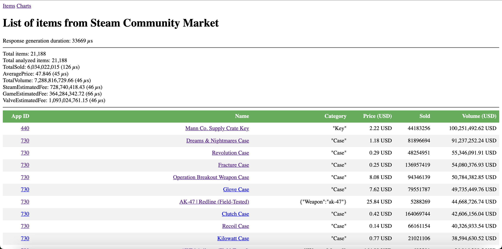
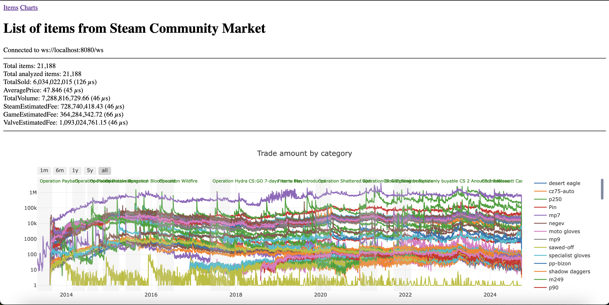
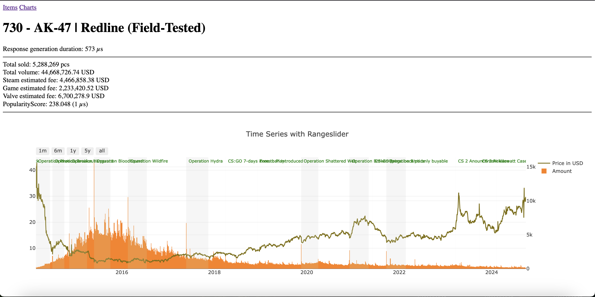

# Steam Analytics (mostly for CS2)

### System Requirements
- Windows, Linux or MacOS
- Rust (should be insttalled. If not, follow the instructions [here](https://www.rust-lang.org/tools/install))
- At least free 1GB of RAM (for 21k items, CS2 game only)

### How to run
At `src/mocked` folder there are almost all CS2 items by the 2024-09-28 date. New items can be added there. Also, you can send plain HTML files to the server and it will parse them (see `localhost:8080/api/import`). Items added by this endpoint are not persisted, so they will be lost after restart.
1. Clone the repo
2. Run `cargo run --release`
3. Open `http://localhost:8080` in your browser
4. Wait until all items are analyzed (it can take a few minutes)
5. Enjoy!

### How to add new events?
Open `src/consts.rs` and add new event to the `EVENTS` array. Don't forget to rebuild the project.

### How to add new items?
There are two ways to add new items:
1. Add a new HTML file to `src/mocked` folder.
2. Send a new HTML file to the server via `localhost:8080/api/import`.

### Screenshots

